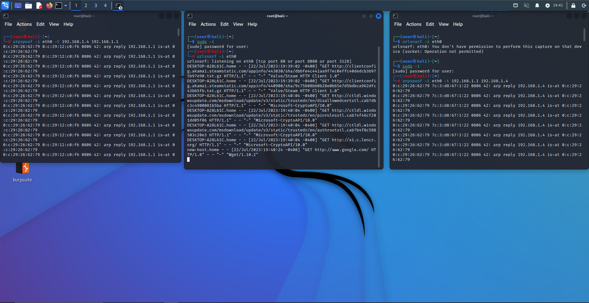
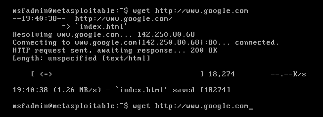

### How the ARP protocol/spoofing works.
* ARP tables pair MAC addresses and IP addresses
* ARP tables are referenced when advertising or finding MAC addresses meant for recievers or senders.
* If device A is in network A, and is sending a packet to network B for device B, the router for network B
  will reference the ARP table to send it to the right device. If it doesn't exist then it will use the MAC
  on the encapsulated packet to find the device with that MAC with an advertisement.
* ARP spoofing is when you change the values in these tables to an attacker's MAC so that traffic is sent to them.
  Used for MITM attacks.
### Tools
* dsniff, a package for tools such as arpspoof
* netdiscover for IP/MAC discovery with ARP queries
* urlsnarf for intercepting and extracting URLS

### Lab
* Enable IP forwarding so that you can forward packets on behalf of someone else.
    * echo 1 > /proc/sys/net/ipv4/ip_forward
* Spoofed the victim machine (Metasploitable 2) ARP table so that the Kali Linux machine is the router to which it sends its requests to
  with arpspoof -i eth0 -t <VICTIM_IP> <ROUTER_IP>
* Spoofed the router ARP table so that the Kali Linux machine is the victim machine to which is sends Metasploitable's responses to
  with arpspoof -i eth0 -t <ROUTER_IP> <VICTIM_IP>
* Opened a 3rd terminal to see intercepted packets from the metasploitable VM and the responses with urlsnarf.

#
Sent a HTTP request to Google, which is intercepted above along with the response
 
  

