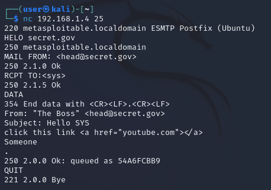
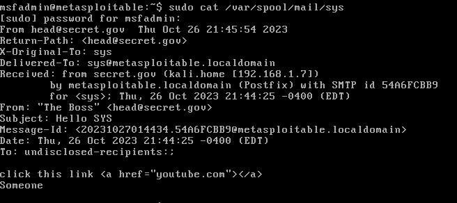
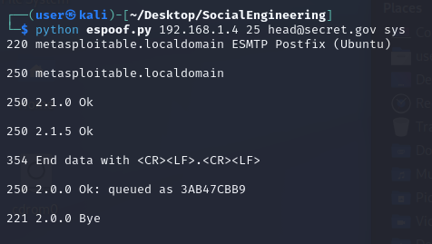

* Sending emails manually via command line.
* This sends an email to our metasploitable VM machine with the SMTP port open.

#
* Confirming reciept of our email on metasploitable

#
* Sending emails manually via script.

