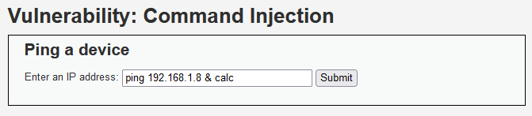
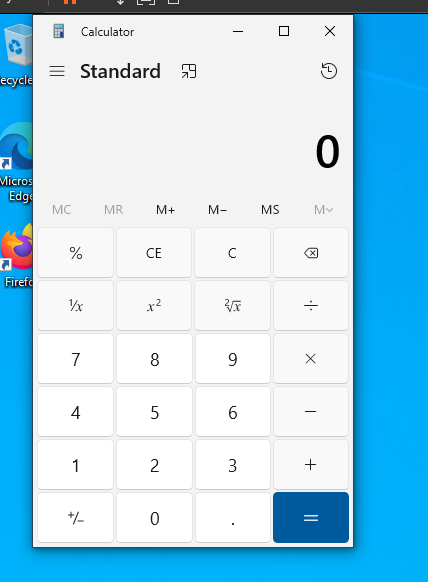
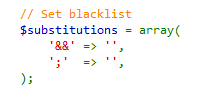
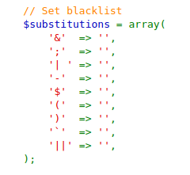

### Security level: LOW
#
* Escaped from the expected command with an & symbol to start the Windows calculator
  application on the virtual machine the web application is running on. Easy test with
  the application set to being very vulnerable.
#

### Security level: MEDIUM
#
* Looking at the source code, they only sanitize && and ; to empty strings. 
* Therefore, our previous command injection on LOW works just the same.
#

#
### Security level: HIGH
#
* The solution to this was using a command with using | without a space afterwards.
* If you were to look at the source code, the developer tried to cover all bases but forgot to remove a whitespace.
* 192.168.1.8|calc would work.
#

