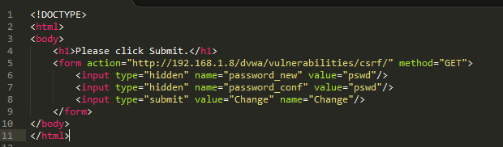
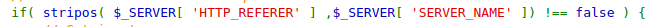
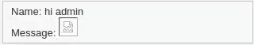
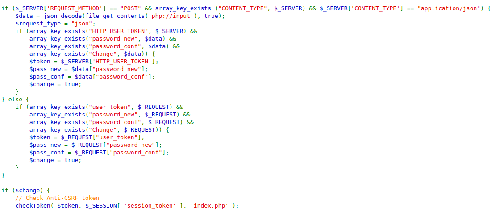

### Security Level: Low
#
* For this attack, we'll host a HTML page that will change the admin's password if they were to visit the page.
* **This page will be hosted on the same server that is running the web application.**
* This doesn't have any access control (checking the origin site) or authorization (cookies) mechanisms to protect the 
  user from social engineering attacks, so it will be quite easy to change their password.
#

### Security Level: Medium
#
* This seem to have worked just fine with my previous HTML page, so I looked at the source code.
* **Looks like there is some access control implemented to see if the connection comes from the same domain (192.168.1.8/test/testscript.html), which it does.**
#

#
* So I tried hosting it somewhere different to see how I would circumvent this.
* I uploaded the HTML page to this repository and accessed it as a GitHub page so it could render the HTML:
[https://apl223.github.io/Portfolio/Cybersecurity/Labs/DVWA/Cross Site Request Forgery/Test pages/testscript.html](https://apl223.github.io/Portfolio/Cybersecurity/Labs/DVWA/Cross%20Site%20Request%20Forgery/Test%20pages/testscript.html)
* As expected, I got the "That request didn't look correct." error.
* I would somehow have to preserve the referrer header as the same as the DVWA host in the request when a user makes a request from my HTML page,
  otherwise the password change will not work. This will most likely involve a layered attack with open redirection or XSS
  to grab that information before I can submit a password change.
* **<meta> elements wont work to remove the requirement of the referrer header since the php source code requires we have it.**
    * Example: <meta name="referrer" content="never"> 
* **Also tried circumventing the referrer check by putting 192.168.1.8 in different parts of the URL with history.pushState(), that didnt work either.**
* One solution was to copy the referrer header that is sent by clicking the "Change" button on the DVWA page to the
  HTTP request that comes from my HTML page. But this is suppose to be a social engineering attack that is supposed to be done on my HTML
  page instead of some MITM that would require a cert to be installed on the victim's browser.
* Although it doesnt involve my HTML page, **the best way would be to find a XSS vulnerability to carry out our CSRF. We can be compliant with the referrer by doing this.**
  Going back to the XSS lab, we can change the admin's password by inserting ><img src="/dvwa/vulnerabilities/csrf/?password_new=pswd&password_conf=pswd&Change=Change">
  into the name field. We can confirm the password was changed via the HTTP responses.
  #
  
  #
  * As a note. the broken image symbol confirms that the > element has been formed. Also meaning it wasn't escaped properly.
  
  #
  * **But this would be hard to pull off in practice because it would require the user to paste that into said form. Unless you have their session cookie, you could do it yourself.**
  * **It would also be difficult to change someone's password because most sites will require you to provide the current or previous password before changing it.**
  * **The biggest takeaway from this is that when access control comes into play, the best way to do a CSRF attack would be an XSS attack or a stored file on the vulnerable web application server.**
    You could look into [Same-Origin Policy Vulnerabilities](https://github.com/Apl223/Portfolio/blob/main/Cybersecurity/Books/BugBountyBootcamp/Same-Origin%20Policy%20Vulnerabilities/README.md) for some other possibilities.
  #
  ### Security Level: High
  #
  * This will require me to add the user token to my XSS that appears in the requests for the password change from the DVWA page.
    But since my HTML page can't be compliant with the referrer header, I'll have to do this from the same host.
  * Since the request will contain my unique cookie, I don't have to specify it in the payload.
  * I've attempted to go back to the XSS (Stored) page on the same security level and enter this into the name field:
      * <body<meta>><<meta>body onload=alert(1)><<meta>img src="/dvwa/vulnerabilities/csrf/?password_new=test&password_conf=test&Change=Change&user_token=4202d63409c601b9230b4834ffa92a89">
        But this didn't work.
      * It looked like the user_token value that was hidden on the /csrf/ page was changing whenever I made a request to it.
  * At this point, I was stuck and researched for solutions and the source code
  #
  
  #
  * Looks like it checks to see if values were set, which I have before so that shouldn't be the problem.
  * The Anti-CSRF token check involves validating the token and redirecting to index.php if the check fails.
  * **The solution was to provide a URL with the the host, the path to the page, and the values to pass. Such as:
    http://192.168.1.8/dvwa/vulnerabilities/csrf/?password_new=test&password_conf=test&Change=Change&user_token=4202d63409c601b9230b4834ffa92a89**
  
