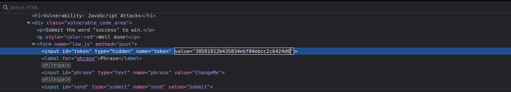
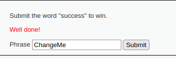
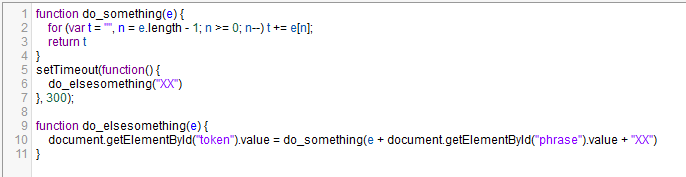

### Security level: LOW
#
* Got stuck on this because I was submitting the word "success" as instructed,
  but it kept telling me that the token was invalid. Which confused me because why would it be?
* After doing a some research, a hash is generated on the basis of encoding the phrase with ROT13, and
  encoding that value with MD5 in the source code. That is then compared to the hidden token value.
  Since the hidden token isn't the right value, we have to figure out what the MD5 hash is for "success" then replace the hidden
  token value with that, then proceed to submit the phrase "success".
    * Text-to-ROT13 converters and MD5 hash generators online were used.
#

#
### Security level: MEDIUM
#
* This JavaScript was hard to read in the source code for this level, so I utilized a online cleaner
  to beautify it.
#

#
* From lines 1-4, do_something() passes the variable e to the for loop
  where t is an emptry string and n is set to the length of e (subtracted by one
  in consideration of the elements) and decrements as long as n is bigger or equal to 0.
  While it iterates, it sets every element in e, denoted by n to t (while it decrements).
* setTimeout delays the execution of do_elsesomething by 300 milliseconds (or 0.3 seconds).
  It also passes the string "XX".
* From lines 11-14, do_elsesomething() passes e to do_something() so that the "token" value is set
  to a concatenation between the value of e, the "phrase" value and "XX".
* Since setTimeout passes "XX", the token value would come out  to be XXsarphXX. sarph being phrase backwards from decrements.
* **The solution of the problem would be typing success backwards, and change the hidden token value to include it between the two XX.
  Since the do_something() function decrements, and by default, the token value is XXeMegnahCXX where the phrase is ChangeMe backwards.**
