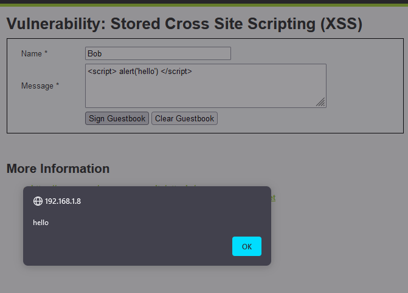
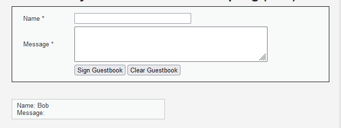
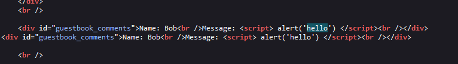
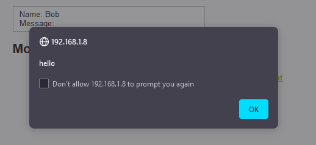

### Security level: LOW

Since this is in an extremely vulnerable state, lets test if it will take a <script> tag with no sanitization:
  

* Looks like it was saved onto the website, as we can see from the source code.

* Whenever I reload the page, it would repeat the alert and create more entries onto the guestbook. To avoid
  this, I would need to clear it via the form button.

# 
