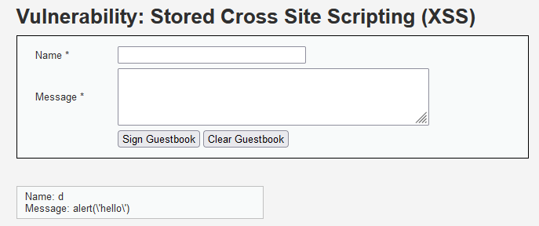
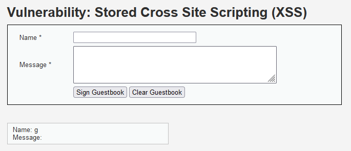
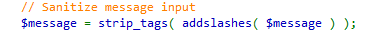
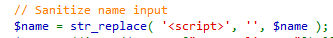
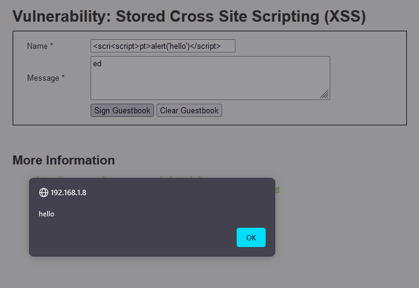
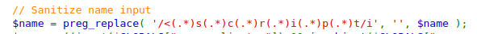

### Security level: LOW
# 
* Since this is in an extremely vulnerable state, we test it with a basic 
* Found some patterns to the sanization, or where characters are being escaped. Looks like <<meta>script> tags are being removed
#

#
* <<meta>body> tags are being sanitized completely, such as <body<meta> onload=alert(1)><meta>.
#

#
* At this point, it was time to look at the source code for any hints.
#

#
* It looks like the message text area strips any tags and adds slashes in the message after submission. Just like what we observed.
* But the name field doesn't have the same stringent rules for sanitization because it replaces 
#

#
### Security level: HIGH
#
* Looking at the source code, there seems to be another one to one conversion of a string to an empty string.
  I thought by changing some of the capitilizations of the letters for that same string it compares itself to, this might've not been
  that complicated to figure out. But the more requests I sent in, I realized it was a more complicated protection mechanism
  involving wildcard symbols (*) because <scri was being filtered for the most part.
* This isn't enough to put together a complete exploit, but its a start. I had a hard time figuring out a solution so I seeked some solutions.
  The hints provided by the DVWA page says that I should use HTML events.
* **Looks like a previous piece of code I used for testing for the medium level problem works for this: <body<meta> onload=alert(1)><meta>.**
  I assumed this wouldn't work before since it didnt work on medium, but that goes to show that these vulernabilities don't work in that fashion where
  more complicated solutions neccasarily exploit simple issues.
#
                                                                     
#
