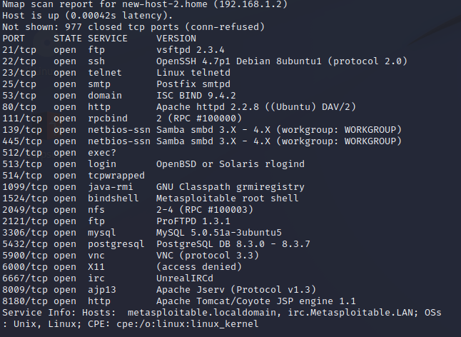
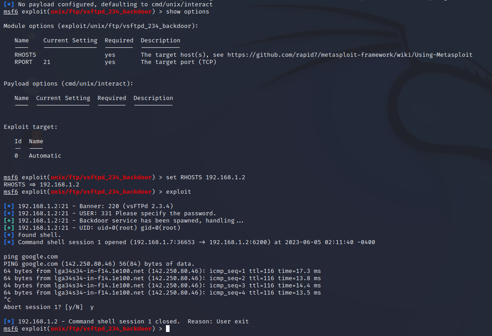
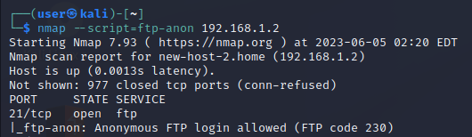
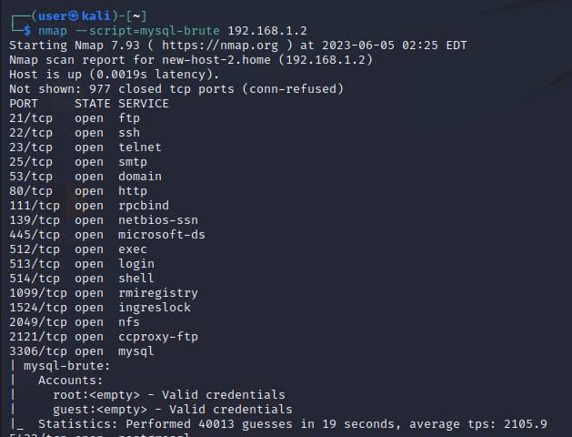

### Goals
* The purpose of this lab is to get some experience with reconnasance tools, scripts and exploit databases.
### Nmap results
* As expected from a vulnerable machine, it has way too many open ports. Plenty of them show OS/version info.
* FTP, SQL & services that involve some sort of authentication would be noteworthy targets.
#
 
### [CVE: 2011-2523, vsftpd 2.3.4 backdoor command execution](https://www.exploit-db.com/exploits/49757)
* Somehow, a malicious backdoor was added into the download archives for this version of VSFTPD back then, and
  we can use it to get a shell.
#

### FTP & SQL weak login credentials
* By running built-in nmap scripts, we can check if the system has weak or non-existant login credentials.
#

#
### [CVE: 2010-2075, UnrealIRCd 3.2.8.1 - Backdoor Command Execution](https://www.exploit-db.com/exploits/16922)
* Although no version number was footprinted, the IRC service only had one exploit related to it. Works with a bind payload.
#
### [Tomcat Ghostcat attack](https://www.rapid7.com/db/modules/auxiliary/admin/http/tomcat_ghostcat/)
* An attacker can read the contents of configuration files and source code files of all webapps deployed on Tomcat.
